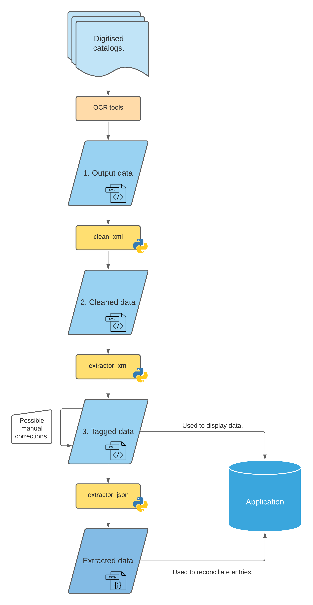

# Application

This repository contains the web publication application of the corpus of manuscript 
sales catalogues. This branch contains the current stable version of the website. See
`versionX.X.X` for the older versions.

---

## Getting started :

- First, download this repository. Using command lines, clone the repository with :
```bash
git clone https://github.com/katabase/Application.git
cd Application
```
- Then, create a virtual environment and activate it :
```bash
python3 -m venv my_env
source my_env/bin/activate
```
- Now, you have to install dependencies :
```bash
pip install -r requirements.txt
```
- You can finally launch the application :
```bash
python3 run.py
```

---

## Use the `KatAPI`

`KatAPI` is an API that allows the automated retrieval of data from the project in 
`json` or `xml-tei`. The API allows to revtrieve catalogue entries by author, sale date
and original date of the manuscript; it also allows to retrieve a complete catalogue, or
statistics on one or several catalogues. Finally, it creates custom error messages in `json`
of `tei` if an error occurs. For a more complete description, please see the Katabase website.

### Quick start

The endpoint for the API is **`https://katabase.huma-num.fr/katapi?`**. The arguments 
provided by the client are added after this endpoint; the application will process
thoses arguments and send back a response in the requested format (`json` or `xml-tei`,
the default being `json`). If there is an error on the client side (unauthorized 
parameters or values) or on the server side (unexpected error), a response will be
issued in `json` or `xml-tei` (depending on the client's request) describing the 
query parameters, the time of the query and the error that occured.

### Possible query parameters and authorized values

#### HTTP methods

The only **authorized HTTP method** is `GET`.

#### Possible parameters

The **possible parameters** are:
- **`format`**: the format of the API's response body. Possible values are:
	- `json`: **this is the default value**.
	- `tei`: return an `xml-tei` response.
- **`level`**: the requested data's level. Possible values are:
	- `item`: data is retrieved at item level. **This is the default value.**
	- `cat_data`: statistical data on one or several catalogues will be retrieved
		- this value is incompatible with the `orig_date` parameter.
	- `cat_full`: a complete catalogue encoded in `xml-tei` will be retrieved
		- if this value is provided, then the only other authorized parameters are
		  `format=tei` and `id` (with `id` matching `CAT-\d+`).
- **`id`**: the identifier of the item or catalogue(s) to retrieve 
  (depending on the value of `level`). If this parameter is provided, data will only
  be retrieved for a single catalogue or catalogue entry. This parameter cannot be used
  together with the `name` parameter. Possible values are:
	- if the query is at item level, a catalogue entry's `@xml:id`. This identifier
	  is a string that matches the pattern: `CAT_\d+_e\d+_d\d+`.
	- the query is run at catalogue level (`level=cat_full` or `level=cat_data`), a 
	  catalogue's `@xml:id`. This identifier is a string that matches the pattern:
	  `CAT_\d+`.
- **`name`**: if the `id` parameter is not supplied, the name of the catalogue(s) or
  catalogue entry(ies) to retrieve. Note that this parameter can, and will, return 
  several items. Possible values:
	- if `level=item`, the `tei:name` being queried. Only the last name in 
	  the `tei:name` is indexed in the search engine and only this one will yield a 
	  result. If a first name and a last name are provided, no result can be yield,
      since the first name is not indexed.
	- if `level=cat_stat`, the catalogue type (to be found in 
	  `(TEI//sourceDesc/bibl/@ana` in the `xml` representation of a catalogue).
	  Possible values are:
		- 'LAD': Lettres autographes et documents historiques,
		- 'RDA': Revue des autographes, des curiosités de l'histoire et de la biographie,
		- 'LAV': Catalogue Laveredet,
		- 'AUC': Auction sale,
		- 'OTH': Other
- **`sell_date`**: the sale date for a manuscript or a catalogue. Values must match
  the regular expression `\d{4}(-\d{4})?`: a year in `YYYY` format or a year range in
  `YYYY-YYYY` foramat.
- **`orig_date`**: the date a manuscript item was created. This parameter is only 
  authorized if `level=item`. Values must match  the regular expression `\d{4}(-\d{4})?`: 
  a year in `YYYY` format or a year range in `YYYY-YYYY` foramat.

---

## Workflow



---

## Website updates and description of the git branches

The structure of the git repository is as follows:
- [`main`](https://github.com/katabase/Application) for the current, stable version of the 
  Katabase app
- [`dev`](https://github.com/katabase/Application/tree/dev) for the unstable version of the
  app, in developpment and not running online.
- [`versionX.X.X`](https://github.com/katabase/Application/tree/version1.0.0) are archive
  repositories to document the former versions of the Katabase app. There should be as many
  of these branches as there are new versions of the website, and their `X.X.X` code should
  follow the release numbers.

New additions to the website should be done on `dev` and tested before being moved to `main`.
The version of the website visible on `main` should be the same as the version of the website
online (unless, for reasons out of our control, we can't publish a new version of the website
online, but a new version is ready and won't be changed again). Before merging a new version
of the website from `dev` to `main`, the `main` branch should be moved the `versionX.X.X`.
A new release should then be created for the updated version of the website.

---

## Credits

The application was designed by Alexandre Bartz and Paul Kervegan with the help of Simon Gabay, Matthias Gille Levenson and Ljudmila Petkovic.

---

## Cite this repository

## Licence
<div style="{display:flex; justify-content:space-around;}">
	<a rel="license" href="http://creativecommons.org/licenses/by/4.0/">
		
	</a>
	<a href="https://www.gnu.org/licenses/gpl-3.0.en.html">
		
	</a>
</div>
<br/>
The catalogues are licensed under 
<a rel="license" href="http://creativecommons.org/licenses/by/4.0/">Creative Commons 
Attribution 4.0 International Licence</a> and the code is licensed under 
<a href="https://www.gnu.org/licenses/gpl-3.0.en.html">GNU GPL-3.0</a>.

